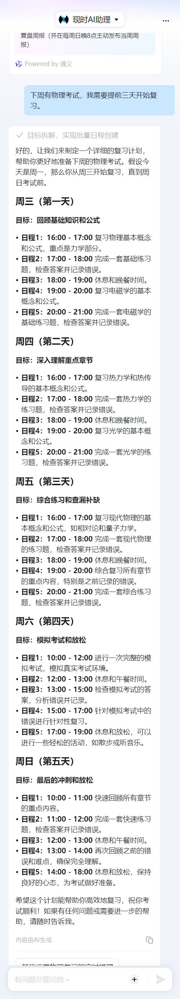
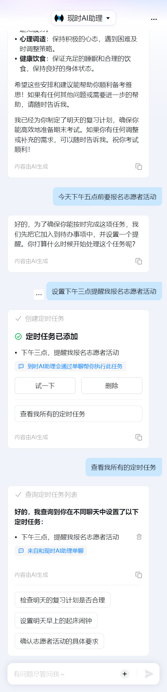

# 现时钉钉ai助理测试记录

# 目录
- [测试项 1：通过聊天的方式添加日程](#测试样例-1通过聊天的方式添加日程)
- [测试结果附图](#测试结果附图)

---

## 测试样例 1：通过聊天的方式添加日程
### 测试用例表

| 测试用例编号 | 测试用例名称     | 测试目的                              | 用户输入                            | 预期结果                                                      | 实际输出 | 测试结果 |
|--------------|------------------|---------------------------------------|-------------------------------------|---------------------------------------------------------------|----------|----------|
| T1-1| 课堂作业提醒     | 验证现时助理能否正确识别作业截止日期并创建提醒 | “我要在下周三之前交数学作业。”      | 现时助理自动在日历中创建一条日程，标题为“提交数学作业”，截止日期设置为下周三。 |正确创建日程，输出为：[ImageT1-1](#t1-1)  |✅  |
| T1-2| 考试复习安排     | 验证现时助理能否根据考试日期创建复习计划     | “下周有物理考试，我需要提前三天开始复习。” | 现时助理在日历中创建复习计划，标题为“物理考试复习”，开始时间为考试前三天，并设置考试日期为事件备注。 |未正确创建日程 输出为：[ImageT1-2](#t1-2)  建议更改为先询问用户具体是周几       |❌          |
| T1-3| 社团活动通知     | 验证现时助理能否识别社团活动时间并创建活动日程 | “周五下午三点有羽毛球社团活动。”     | 现时助理在日历中创建社团活动日程，标题为“羽毛球社团活动”，时间为本周五下午3点。 |正确创建日程，输出为：[ImageT1-3](#t1-3)  |✅ |
| T1-4| 学习小组讨论     | 验证现时助理能否识别小组讨论时间和地点       | “我们学习小组计划周日下午两点在图书馆讨论课题。” | 现时助理在日历中创建一条日程，标题为“学习小组讨论”，地点为图书馆，时间为本周日下午2点。 |正确创建日程，输出为：[ImageT1-4](#t1-4)          |✅ |
| T1-5| 提交项目报告     | 验证现时助理能否识别报告提交截止日期         | “我的项目报告得在这个月的最后一天前提交。” | 现时助理在日历中创建一条日程，标题为“提交项目报告”，日期为本月最后一天。 |未正确创建日程，输出为：[ImageT1-5](#t1-5) 建议添加提示词 这个月最后一天    |❌|
| T1-6| 提醒早起准备考试   | 验证现时助理能否生成早起提醒               | “明天有期末考试，我得早点起床复习。”   | 现时助理创建一个提醒，标题为“期末考试早起复习”，时间为次日早晨（可以设定一个默认的早起时间，例如7点）。 |未正确创建日程，输出为：[ImageT1-6](#t1-6)     | ❌         |
| T1-7| 活动报名截止     | 验证现时助理能否识别报名截止时间并创建提醒   | “今天下午五点前要报名志愿者活动。”   | 现时助理询问用户何时提醒，按照用户回答的提醒时间在日历中创建，标题为“志愿者活动报名”。 |正确创建提醒，输出为[ImageT1-7](#t1-7)| ✅         |
| T1-8| 约见教授         | 验证现时助理能否识别与教授会面的时间和目的   | “我明天上午10点要去找李教授咨询一下项目问题。” | 现时助理在日历中添加一条事件，标题为“会见李教授”，时间为次日10:00，并备注“项目咨询”。 | 未正确创建日程，输出为 [ImageT1-8](#t1-8)        | ❌         |

# 测试结果附图
## T1-1

## T1-2

## T1-3

## T1-4

## T1-5

## T1-6

## T1-7

## T1-8

